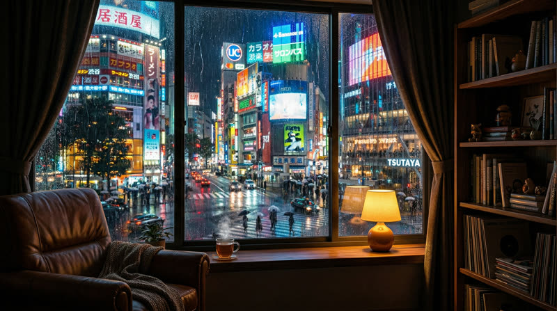
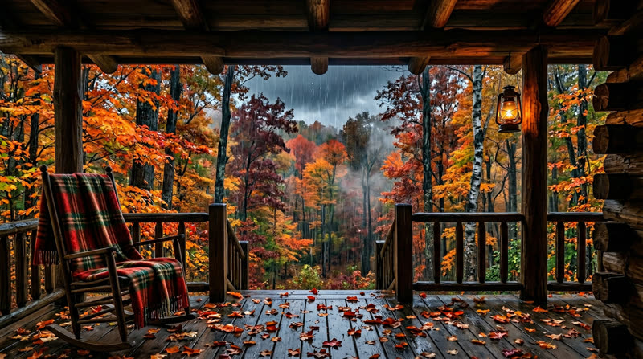
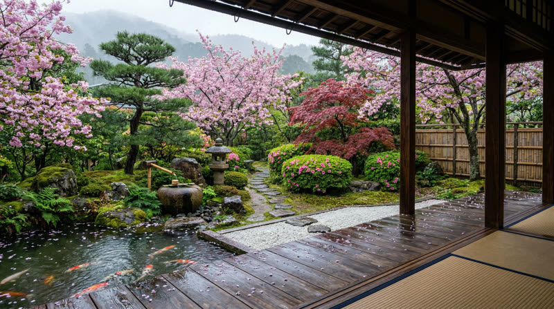

# Rain View

**Find stillness in the rain.**

An ambient rain simulator with four cinematic looping scenes, five rain soundscapes, and five looping piano tracks (recorded music). Built with vanilla HTML, CSS, and JavaScript. No frameworks, no build tools.

Project documentation for **[StewAlexander-com/rain-view](https://github.com/StewAlexander-com/rain-view)** lives in this `README.md` at the repository root.

[**Live demo**](https://stewalexander-com.github.io/rain-view/)

---

## Screenshots

**Splash & scene picker** — choose a scene; audio starts after you tap a card (browser autoplay policy).


**Scene thumbnails** (Tokyo, New York, Autumn Forest, Zen Garden):

| Tokyo Evening | New York Night |
|:---:|:---:|
|  |  |

| Autumn Forest | Zen Garden |
|:---:|:---:|
|  |  |

---

## Scenes

Defaults match `app.js` (`SCENES`):

| Scene | Setting | Default pairing |
|-------|---------|-----------------|
| **Tokyo Evening** | Neon-lit streets through rain-kissed glass | Window rain, Contemplative piano |
| **New York Night** | Manhattan skyline, steam, and amber light | Heavy rain, Jazz piano |
| **Autumn Forest** | Fall foliage and mountain mist | Forest rain, Melancholic piano |
| **Zen Garden** | Cherry blossoms and rain on still water | Gentle rain, Ethereal piano |

Each scene loads a looping MP4 (`assets/scene-*.mp4`) with a vignette overlay. Choosing a scene applies its default rain and piano variants; both can be changed with the pill selectors.

## Features

- **Five rain soundscapes** — Gentle, Heavy, Window, Forest, and Thunder (`assets/rain-*.mp3`). Switching variants stops the previous loop immediately and fades in the new one (~650 ms, `requestAnimationFrame`).
- **Five piano loops** — Real recorded tracks (`assets/piano-*.mp3`): Contemplative, Jazz, Melancholic, Ethereal, Pastoral. Same behavior as rain. Entering a scene starts rain at volume **0.7** and piano at **0** until you raise the piano slider (`app.js`). Attribution: see `AUDIO-CREDITS.txt` (CC BY 4.0, Kevin MacLeod / incompetech.com).
- **Independent volume** — Separate sliders for rain and piano.
- **Play / pause** — Each row has a button that pauses that layer (icon switches to play) and resumes from the same position in the loop (`audio-system.js` + `app.js`).
- **Auto-hiding controls** — Control panel hides after **4 seconds** of inactivity; mouse move or touch shows it again (`app.js`).
- **PWA-ready** — `manifest.json`, icons under `icons/`, mobile meta tags.
- **Mobile responsive** — Touch-friendly layout and pill controls; see `style.css` for `prefers-reduced-motion` handling.
- **Keyboard** — **Escape** returns to the splash screen when a scene is active (`app.js`).

## Architecture

`index.html` loads **`audio-system.js`** then **`app.js`** with a **`?v=`** query on each script so updates are not stuck behind disk cache.

### Caching / releases (do this whenever you ship audio changes)

Browsers cache JS and MP3s aggressively. After changing assets or audio code:

1. Bump **`RV_AUDIO_ASSET_VER`** in `audio-system.js` (forces new `…mp3?v=…` URLs).
2. Bump the **`?v=`** on **both** `<script>` tags in `index.html` (forces new `audio-system.js` / `app.js`; otherwise old JS may never load the new query strings).
3. Bump **`?v=`** on the **`style.css`** `<link>` when you change layout or control styles.

When testing in Chrome DevTools, enable **Disable cache** on the Network tab so you are not fooled by disk cache. After auto-hide, **click or tap the scene** to bring the control panel (and play/pause buttons) back — moving the mouse alone is not required on desktop.

```
rain-view/
├── index.html          # Splash + scene shell, control panel, script tags
├── style.css           # Layout, glass UI, responsive rules
├── app.js              # SCENES map, enter/exit, pills, auto-hide, Escape
├── audio-system.js     # Ambient loops: rain + piano, one script
├── AUDIO-CREDITS.txt   # Piano track titles and CC BY attribution
├── manifest.json
├── screenshots/        # Images for this README (GitHub rendering)
├── assets/
│   ├── scene-*.mp4     # Four looping videos
│   ├── rain-*.mp3      # Five rain tracks
│   ├── piano-*.mp3     # Five piano loops (see AUDIO-CREDITS.txt)
│   ├── thumb-*.jpg     # Splash card thumbnails
│   └── splash-rain-window.jpg
└── icons/              # PWA / favicon / OG assets
```

### Audio (`audio-system.js`)

- **`AmbientLoopLayer`** (internal) — One `<audio>` per variant, attached to a hidden host in the document. **Outgoing** track: volume 0 + pause immediately (no overlapping fade-out timers). **Incoming**: `play()` with a short retry, then **fade-in only** via `requestAnimationFrame`, gated by a generation counter so rapid switches or slider moves do not leave stale state.
- **`AudioEngine`** — Two layers (rain + piano). `setVolume` bumps the generation and applies the level immediately. **User pause** skips auto-resume on tab visibility and keeps variant switches from auto-playing until the user hits play. **Per-track `error`** handler marks the node; **visibility** recovery tries `play()` again when returning from a background tab if the user had volume up and did not pause.

## Run locally

1. **Get the project** — `git clone https://github.com/StewAlexander-com/rain-view.git` or download the ZIP from GitHub.

2. **Serve over HTTP** — Do not rely on `file://` for normal use; use a static server so media and script behavior match a deployed site.

```bash
cd rain-view

npx serve .
# or
python3 -m http.server 8000
```

3. Open `http://localhost:3000` or `http://localhost:8000`. Rain and piano playback expect a **user gesture** (e.g. clicking a scene card) due to browser autoplay policy.

### Network requirements for a local build

- **Same-origin assets** (HTML, CSS, JS, MP4, MP3, images) are all local under the repo.
- **Google Fonts** load from `fonts.googleapis.com` / `fonts.gstatic.com` on first load; offline, the UI still runs with fallback fonts.
- **No `npm install`** is required unless you use a tool like `npx serve`.

## Credits

- **Rain audio** — MP3 files in `assets/`.
- **Scene videos** — MP4 files in `assets/`.
- **Piano** — Kevin MacLeod (incompetech.com), CC BY 4.0; titles and filenames in `AUDIO-CREDITS.txt`.
- **Fonts** — [Cormorant Garamond](https://fonts.google.com/specimen/Cormorant+Garamond) and [Inter](https://fonts.google.com/specimen/Inter) via Google Fonts.

## License

MIT — see [LICENSE](https://github.com/StewAlexander-com/rain-view/blob/main/LICENSE).
