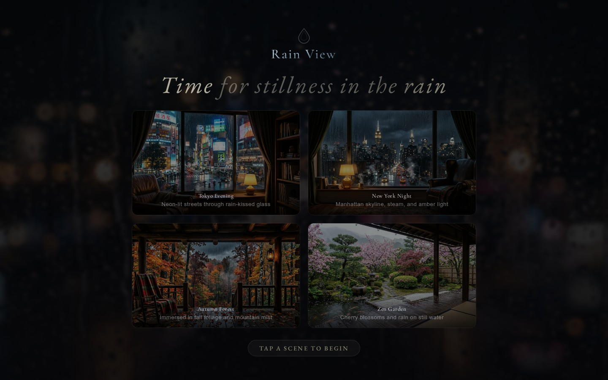
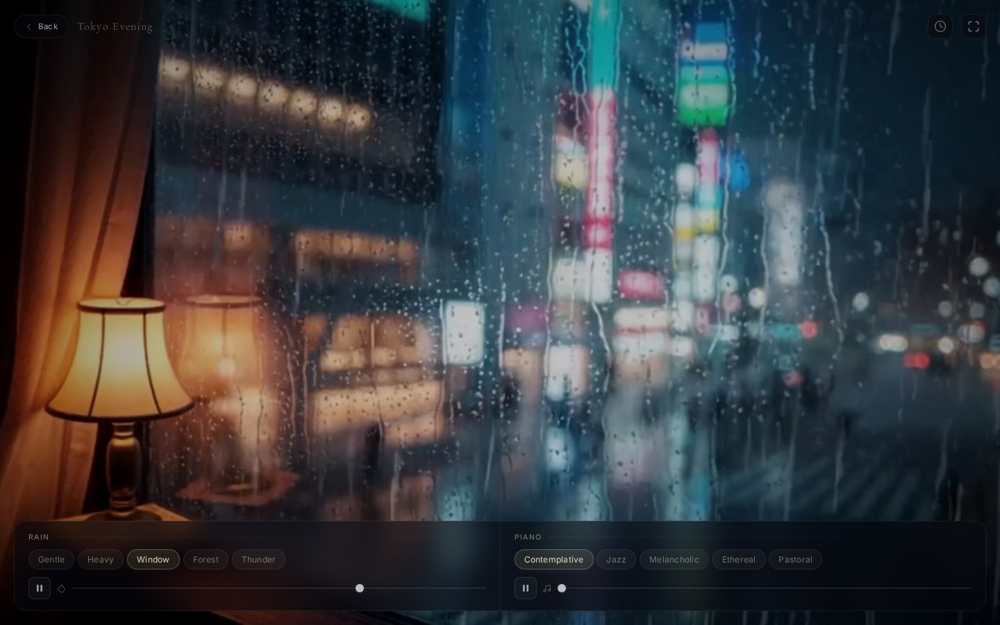
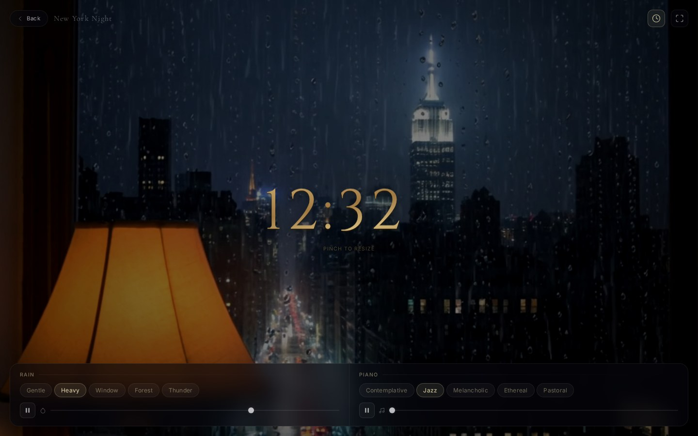
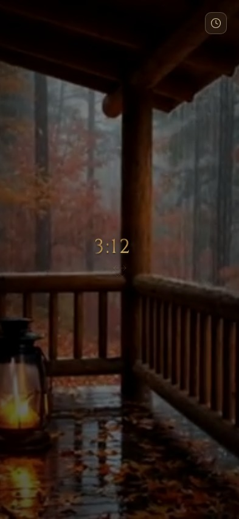

# Rain View

**Find stillness in the rain.**

A contemplative ambient rain simulator — 4 cozy cinematic scenes with real rain audio, gentle piano, a resizable sleep clock, and looping video. Built for mobile, optimized for iOS PWA. No frameworks, no dependencies, no ads.

[**Live Demo →**](https://stewalexander-com.github.io/rain-view/)



---

## Scenes

| Scene | Setting | Mood |
|-------|---------|------|
| **Tokyo Evening** | Cozy room overlooking Shibuya neon streets | Rain on glass, warm lamp, urban calm |
| **New York Night** | Manhattan apartment window, Empire State | Steam, taxis, amber bokeh through rain |
| **Autumn Forest** | Log cabin porch, New England fall foliage | Rain in the trees, lantern glow, solitude |
| **Zen Garden** | Japanese engawa, cherry blossoms, koi pond | Gentle rain, mist, stillness |



---

## Sleep Clock

Tap the clock icon in the upper right to activate an elegant overlay clock — perfect for bedside use while rain plays in the background.



- **Cinzel typeface** — Roman-proportioned serif with a brushed brass metallic finish (regular weight, not bold)
- **Embossed gold effect** — gradient text fill sweeping from warm ruddy brass to lighter gold, with bevel shadows creating a raised stamped-metal appearance
- **Pinch to resize** — two-finger pinch anywhere on screen (mobile) or scroll wheel (desktop) to scale from compact to screen-filling (0.4x–3.0x)
- **Background dims** when the clock is active for clear readability against any scene
- **Tap to dismiss** — tap the dimmed background or the clock button to close
- **Always accessible** — clock button stays visible in the top-right even when audio controls auto-hide
- **Controls suppressed** — audio controls hide while the clock is active so pinch gestures aren't intercepted
- **Visual hint** — subtle expand-arrows icon pulses briefly on activation to signal resizability



---

## Audio

### Rain Variants

| Variant | Character |
|---|---|
| Gentle | Light, soft patter |
| Heavy | Full, immersive downpour |
| Window | Rain tapping on glass |
| Forest | Rain on leaves and canopy |
| Thunder | Rain with distant rumble |

### Piano Variants

| Variant | Character |
|---|---|
| Contemplative | Sparse, minor key, cinematic |
| Jazz | Warm, major 7th chords, nostalgic |
| Melancholic | Emotional, modern classical |
| Ethereal | Ambient, spacious, slow |
| Pastoral | Light, meditative, Satie-like |

Piano starts muted — slide the volume up to layer it in. Each scene has a default rain + piano pairing, but you can mix and match freely.

---

## Features

- **AI-generated looping video** — each scene is an 8-second cinematic loop with rain baked into the animation
- **5 rain + 5 piano variants** — real recordings, professionally cleaned and seamless-looped
- **Sleep clock** — elegant resizable brass clock overlay for bedside use
- **Mobile-first** — 720p mobile video variants (~400KB vs ~7MB desktop), compact touch-friendly controls
- **iOS PWA optimized** — auto-recovery from MEDIA_ERR_DECODE on cold start, Web Audio API bypassed on iOS
- **Installable** — PWA manifest, home screen icon, standalone display mode
- **Social sharing** — Open Graph + Twitter Card meta tags with preview image
- **Auto-hiding controls** — glassmorphism UI fades after 4 seconds, reappears on touch
- **Zero dependencies** — vanilla HTML/CSS/JS, no build tools, no npm

---

## Running Locally

```bash
npx serve .
# or
python3 -m http.server 8000
```

---

## Tech Notes

### iOS Audio Architecture

iOS Safari and PWA mode have strict audio restrictions. Rain View handles them:

1. **No Web Audio API on iOS** — `AudioContext` and `MediaElementSource` are bypassed entirely. Volume is controlled via `HTMLAudioElement.volume` (iOS overrides with physical volume buttons).
2. **No blob URLs on iOS** — `fetch()→blob→createObjectURL` causes `MEDIA_ERR_DECODE` in PWA mode. Plain src URLs are used instead.
3. **MEDIA_ERR_DECODE auto-recovery** — on PWA cold start, iOS sometimes fails to decode audio before the media session initializes. When detected, the tainted `<audio>` element is destroyed and replaced with a fresh one.
4. **Silent MP3 activation** — a tiny data URI MP3 is played on first touch to activate the iOS audio session.
5. **Retry cascade** — after entering a scene, playback is retried at 50/150/350/700/1200/2000/3500ms.

### Diagnostic Panel

Triple-tap the scene title to show a real-time audio diagnostic overlay. Shows AudioContext state, element playback state, MES connection status, errors, and version number.

### Performance

- Desktop video: ~7MB per scene (1080p)
- Mobile video: ~400KB per scene (720p, auto-detected)
- Audio: 5 rain + 5 piano MP3s, professionally EQ'd and seamless-looped
- Total mobile payload: ~3MB for first scene load

---

## Credits

**Rain audio** — [Pixabay Sound Effects](https://pixabay.com/sound-effects/) (Pixabay Content License)
**Piano audio** — [Pixabay Music](https://pixabay.com/music/) (Pixabay Content License)
**Scene video/images** — AI-generated

All audio professionally cleaned: high-pass filtered (60Hz), low-pass filtered (14kHz), normalized, seamless crossfade loop spliced. See [AUDIO-CREDITS.txt](AUDIO-CREDITS.txt) for individual track attributions.

## License

MIT — see [LICENSE](LICENSE).

---

*Built with stillness in mind.*
